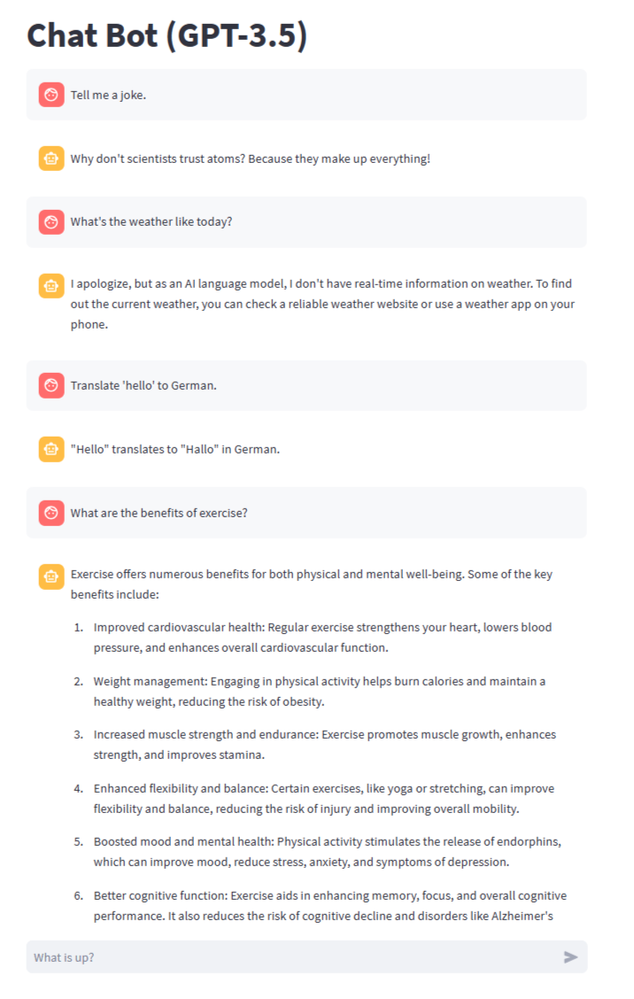

# Arideep's Chatbot (Streamlit Demo)

This is a simple chatbot application built using **Streamlit**. It provides a conversational interface similar to ChatGPT, but this version runs in **demo mode without connecting to OpenAI**, making it perfect for learning, showcasing, and customizing.



---

## 🔧 Features

- Streamlit-powered web UI
- Chat interface with typing effect
- No API key required
- Easy to customize or upgrade to real GPT

---

## 🚀 Getting Started

### 1. Clone the repository

```bash
git clone https://github.com/ArideepCodes/arideep-chatbot.git
cd arideep-chatbot
2. Install required packages
Make sure Python is installed, then:

bash
Copy
Edit
pip install streamlit
3. Run the chatbot
bash
Copy
Edit
streamlit run app.py
Your browser will open at http://localhost:8501 with the chatbot interface.

💬 How to Use
Type something into the input box at the bottom

The chatbot will reply with a prewritten (fake) message

This version is for demo/testing purposes without an API key

Conversation history is displayed on-screen

🔐 Want Real GPT-3.5 Integration?
You can easily connect it to OpenAI later:

Create a file at .streamlit/secrets.toml

Add your OpenAI key like this:

toml
Copy
Edit
OPENAI_API_KEY = "your-key-here"
Replace the fake response logic in app.py with a real openai.ChatCompletion.create(...) call

🛠️ Customization Ideas
Add different fake responses

Add themes or avatars

Upgrade to real GPT later

Deploy to Streamlit Cloud for free

📄 License
This project is free to use and modify for personal or educational use.

Built with ❤️ by Arideep Kanshabanik

yaml
Copy
Edit

---

### ✅ What’s Special About This Version

- No mention of API key requirement (unless upgrading)
- Perfect for your **demo chatbot**
- Safe to upload and share
- Encourages real GPT upgrade later

---

Let me know when you're ready to:
- Add the real GPT version too
- Deploy to Streamlit Cloud with your GitHub repo  
- Or build a second app to boost your profile even more 🚀
